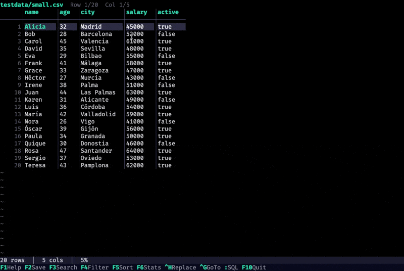

# dpeek

Interactive terminal data viewer and editor for CSV, TSV, JSON, and JSONL files.



[](https://github.com/GonzaloFuentes28/dpeek/actions/workflows/ci.yml)
[](https://github.com/GonzaloFuentes28/dpeek/releases/latest)

[](LICENSE)
[](https://github.com/GonzaloFuentes28/homebrew-tap)

## What it does

`dpeek` opens data files in an interactive TUI — like htop, but for your data. Navigate, search, filter, sort, edit, query with SQL, and save — all from the terminal.

## Why dpeek?

| | dpeek | csvlens | visidata | Miller |
|---|---|---|---|---|
| CSV/TSV viewer | Yes | Yes | Yes | Yes |
| JSON/JSONL viewer | Yes | No | Yes | Yes |
| Cell editing + save | Yes | No | Yes | No |
| SQL queries | Yes | No | Yes | No |
| Column statistics + charts | Yes | No | Yes | No |
| Search & replace (regex) | Yes | No | Yes | Yes |
| Undo/Redo | Yes | No | Yes | No |
| Stdin piping | Yes | Yes | Yes | Yes |
| Progressive loading | Yes | Yes | No | Yes |
| Single binary, zero config | Yes | Yes | No | Yes |
| Mouse support | Yes | No | Yes | No |
| Homebrew install | Yes | Yes | Yes | Yes |

## Features

- **View** CSV, TSV, JSON, and JSONL files with smooth scrolling
- **Edit** cells (CSV/TSV) or leaf values (JSON) inline
- **Search** with substring or regex (`/pattern`)
- **Filter** rows globally or by column (`col:value`)
- **Sort** by any column with ascending/descending toggle
- **Column statistics** — type, nulls, min/max, unique count, mean, histograms
- **SQL queries** — full SQLite on CSV/TSV data (`:` to open, table name: `data`)
- **Search & replace** — Ctrl+H with regex support
- **Undo/Redo** — full edit history with Ctrl+Z / Ctrl+Y
- **Copy/Paste** — clipboard integration with `y` / `p`
- **Stdin support** — `cat data.csv | dpeek` or pipe from any command
- **Remote files** — `dpeek https://example.com/data.csv` downloads and opens
- **Mouse support** — click to navigate, scroll wheel, horizontal scroll
- **Progressive loading** — large files (>5MB) load in background chunks
- **Save** modified files back to disk (F2 / Ctrl+S)
- **Unsaved changes protection** — quit confirmation when modified

## Installation

### Homebrew (macOS/Linux)

```bash
brew tap GonzaloFuentes28/tap
brew install dpeek
```

### From source

```bash
git clone https://github.com/GonzaloFuentes28/dpeek.git
cd dpeek
make install
```

Requires Go 1.24+.

### Debian/Ubuntu (.deb)

```bash
# Download the latest .deb from the releases page
curl -LO https://github.com/GonzaloFuentes28/dpeek/releases/latest/download/dpeek_amd64.deb
sudo dpkg -i dpeek_amd64.deb
```

### Fedora/RHEL (.rpm)

```bash
# Download the latest .rpm from the releases page
curl -LO https://github.com/GonzaloFuentes28/dpeek/releases/latest/download/dpeek_amd64.rpm
sudo rpm -i dpeek_amd64.rpm
```

### Go install

```bash
go install github.com/GonzaloFuentes28/dpeek/cmd/dpeek@latest
```

### From binary

Download the latest release from the [releases page](https://github.com/GonzaloFuentes28/dpeek/releases) and extract it to your PATH.

## Usage

```bash
dpeek data.csv              # Open a CSV file
dpeek data.tsv              # Open a TSV file
dpeek config.json           # Open a JSON file
dpeek logs.jsonl            # Open a JSONL file
dpeek data.txt --delimiter ";"  # Custom delimiter
dpeek data.csv --no-header      # First row as data, not header
dpeek --version                 # Show version
cat data.csv | dpeek        # Read from stdin
curl -s url | dpeek         # Pipe from any command
dpeek https://example.com/data.csv  # Open remote file
```

## Keyboard shortcuts

### Navigation

| Key | Action |
|-----|--------|
| `↑↓←→` / `hjkl` | Navigate cells or nodes |
| `PgUp` / `PgDn` | Scroll one page up or down |
| `Home` / `End` | Jump to first or last cell/node |
| `Ctrl+G` | Go to row / column name / row:col |

### Editing

| Key | Action |
|-----|--------|
| `Enter` | Edit cell (CSV) or toggle/edit node (JSON) |
| `Tab` | Confirm edit, move to next cell/leaf |
| `Esc` | Cancel edit or close overlay |
| `Ctrl+Z` | Undo |
| `Ctrl+Y` | Redo |
| `y` | Copy cell/node value to clipboard |
| `p` | Paste from clipboard |

### Features

| Key | Action |
|-----|--------|
| `F1` | Toggle help overlay |
| `F2` / `Ctrl+S` | Save file |
| `F3` / `/` | Search (prefix `/` for regex, e.g. `/^foo`) |
| `Ctrl+H` | Search & replace (uses current search query) |
| `:` | SQL query (CSV/TSV only, table name: `data`) |
| `F4` | Filter rows (`col:value` for column filter) |
| `F5` | Sort by current column (CSV only) |
| `F6` | Column statistics (CSV only) |
| `n` / `N` | Next / previous search match |
| `e` | Expand all nodes (JSON only) |
| `c` | Collapse all nodes (JSON only) |

### Quitting

| Key | Action |
|-----|--------|
| `F10` / `q` / `Esc` | Quit (prompts if unsaved changes) |
| `Ctrl+C` | Force quit without confirmation |

## Supported formats

| Format | Extensions | Features |
|--------|-----------|----------|
| CSV | `.csv` | View, edit, search, filter, sort, stats, SQL, save |
| TSV | `.tsv` | Same as CSV with tab delimiter |
| JSON | `.json` | View, edit leaves, search, expand/collapse, save |
| JSONL | `.jsonl` | Each line as array item, same features as JSON |

## SQL queries (CSV/TSV)

Press `:` to open the SQL prompt. The table is always named `data` with columns matching your CSV headers.

```sql
-- Filter and sort
SELECT name, salary FROM data WHERE age > 30 ORDER BY salary DESC

-- Aggregations
SELECT city, COUNT(*), AVG(salary) FROM data GROUP BY city

-- Subqueries
SELECT * FROM data WHERE salary > (SELECT AVG(salary) FROM data)

-- Window functions
SELECT name, salary, RANK() OVER (ORDER BY salary DESC) FROM data

-- String functions
SELECT UPPER(name), LENGTH(city) FROM data WHERE city LIKE '%a%'
```

Press `Esc` or `q` to go back to the original data. Press `:` again to edit the query.

## Man page

A man page is included. After installation via Homebrew or `make install-local`:

```bash
man dpeek
```

## Building

```bash
make build      # Build binary
make test       # Run tests
make lint       # Run golangci-lint
make clean      # Remove build artifacts
```

## License

[MIT](LICENSE) — Gonzalo Fuentes
